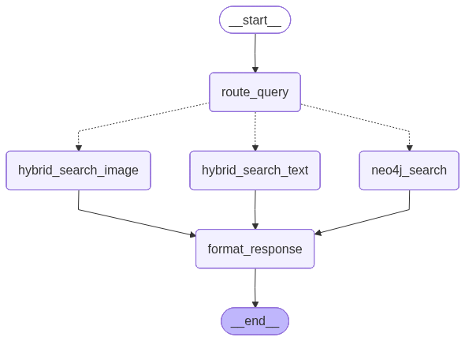
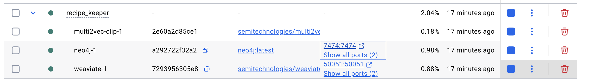
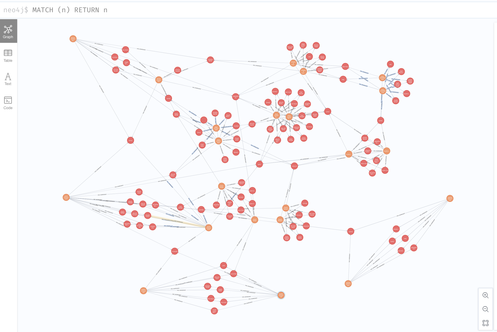
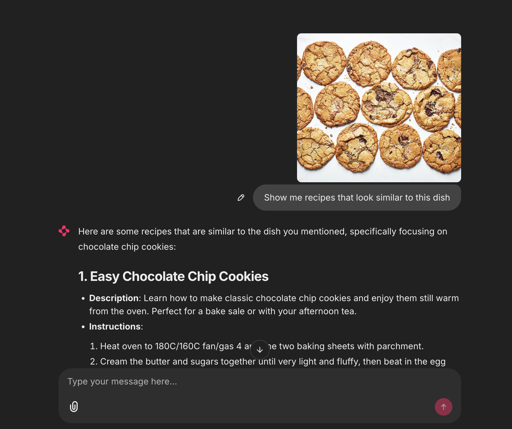

# Recipe Keeper

Hope you like this app and bon appétit!

## Prerequisites

To install the application, you need:

1. Python3 and uv package manager. After installing them, run the following command to install dependencies:

    ```bash
    uv sync
    ```
2. Docker installed to run Neo4j and Weaviate containers.
3. Node.js (optional): Required if you want to use the extension to populate recipes. Otherwise, you can use the test recipes in the recipes folder.
4. Add your OPENAI_API_KEY to the .env file.

## System Architecture

The application implements a Retrieval-Augmented Generation (RAG) pipeline using FastAPI for orchestration.

* **Neo4j**: Serves as the graph database to model structured relationships between recipes, ingredients, and nutritional information. This enables complex traversal and filtering that flat data structures cannot efficiently handle.
* **Weaviate**: Used as the vector database for its native multi-modal support (via `multi2vec-clip`). This allows for hybrid search capabilities, enabling the system to understand and retrieve recipes based on both text and image inputs.
* **LangGraph**: Used for orchestration.
* **OpenAI**: Used as the LLM for inference during chat and text embeddings for Weaviate vectorization.
* **Chainlit**: Provides the interactive chat interface.

Here is the chat flow:


## Getting Started

1. Initialize the FastAPI backend:
    ```bash
    make server
    ```
2. Start Neo4j and Weaviate containers:

    ```bash
    docker compose up -d
    ```


3. Start the Chainlit UI app:

    ```bash
    make chat
    ```
    Open http://localhost:8002 in your browser to see the chatting app.

4. Optional: You can install the browser extension to send recipes from your browser to the database:

    ```bash
    cd extension
    npm install
    npm run build
    ```
    See the README.md in the extension folder for more details.

    Alternatively, you can use the existing test recipes saved in the recipes folder:

    ```bash
     cp test-recipes/* recipes/
    ```

5. Run RAG to populate Neo4j and Weaviate:
    ```bash
    make rag
    ```

6. Check if the graph is created in Neo4j. Use the password defined in the .env file.
    ```bash
    http://localhost:7474
    ```

    Run the following Cypher query to check if the graph is created:
    ```bash
    MATCH (n)
    RETURN n
    ```

    You should see something like this:

    

7. You are now ready to chat with the Recipe Keeper.
    Here are example messages:

    ```
    Recipes that use these ingredients: mushrooms
    Show me recipes using chicken but NOT butter
    Find recipes with sugar
    Show me a recipe with creamy chicken and mushrooms
    Give me quick dinner ideas under 20 minutes
    Show me recipes that look similar to this dish
    Find recipes that look like this image but also mention spicy ingredients
    What can I use instead of ricotta?
    List all ingredients for Recipe_123
    What recipes did user Julia create?
    Find spicy chicken dishes with less than 10g carbs.
    ```

    Here is an example of chatting with the Recipe Keeper:
    

## TODO:
    1. Add more recipes to test folder
    2. Implement evals to check if RAG and chat are working
    3. Allow injecting new recipes via chat
    4. Add authentication
    5. Add Airflow to schedule RAG
    6. Handle all errors
    7. Add telemetry for logging
    8. Add guardrails to prevent abuse
    9. Tested on macOS. Windows and Linux support needs verification.