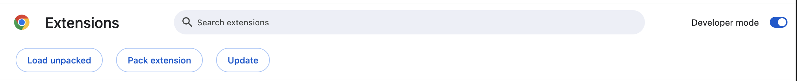

# Recipe Keeper Chrome Extension

## Installation

1. **Build the extension** (if not already built):
   ```bash
   cd extension
   npm install
   npm run build
   ```

2. **Load in Chrome**:
   - Open Chrome and navigate to `chrome://extensions/`
   - Enable "Developer mode" (toggle in top right)
   - Click "Load unpacked"
   - Select the `apps/extension/dist` folder
   - The extension will appear in your Chrome toolbar

   

3. **Usage**:
   - Click the extension icon in the toolbar to open the popup
   - The extension can save job postings from the current tab

